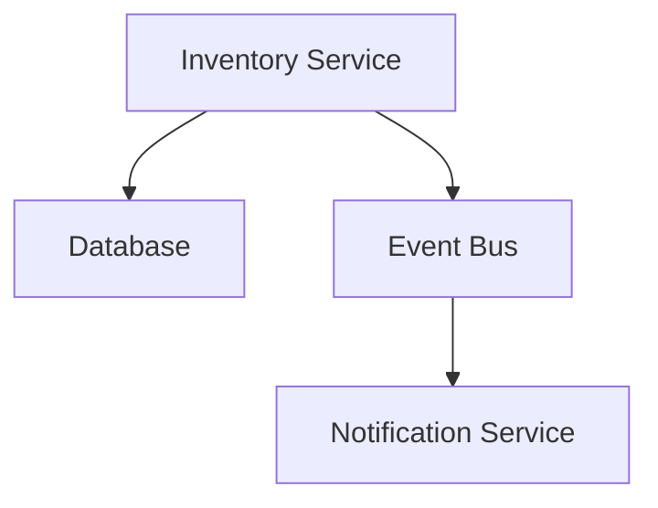

# Inventory Service

<Admonition type="info">
This service handles all inventory management for our e-commerce platform.
</Admonition>

## Overview

The Inventory Service is responsible for:

- Managing stock levels
- Processing inventory updates
- Sending inventory notifications

## Architecture

